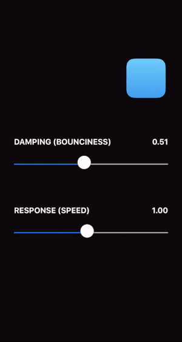
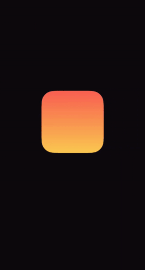
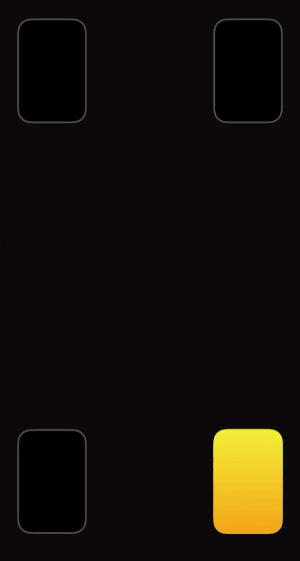
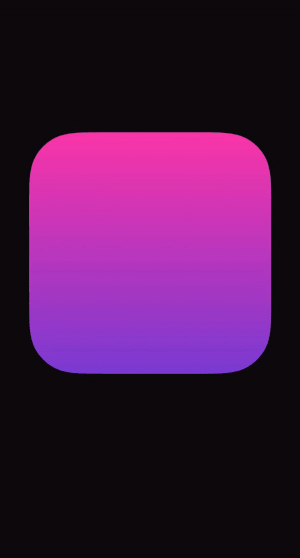

### ⏩ Check out the accompanying blog post for more details: [Building Fluid Interfaces]() ⏪

### Background

At WWDC 2018, Apple designers gave a talk titled "Designing Fluid Interfaces", explaining the design theory behind the gesture-based interface of iPhone X. (The presentation is available here: [Designing Fluid Interfaces](https://developer.apple.com/videos/play/wwdc2018/803/))

It was an outstanding talk, inspiring designers and developers to think about animated interfaces in a new way. While some technical guidance was provided, most code-level implementation details were ommitted.

The goal with this project is to bridge the gap between inspiration and implementation.

### Installation

Download or clone the repo and open the `FluidInterfaces.xcodeproj` file with Xcode 10.

## Calculator Button

A button that mimics the behavior of buttons in the iOS Calculator app.

[⚙️ CalculatorButton.swift](FluidInterfaces/FluidInterfaces/CalculatorButton.swift)

[📺 Designing Fluid Interfaces 50:13](https://developer.apple.com/videos/play/wwdc2018/803/?time=3013)

## Spring Animations

A demo showing the ability to define a spring animation with "design-friendly" parameters.

[⚙️ Spring.swift](FluidInterfaces/FluidInterfaces/Spring.swift)

[📺 Designing Fluid Interfaces 31:40](https://developer.apple.com/videos/play/wwdc2018/803/?time=1900)

## Flashlight Button

A button that mimics the behavior of the flashlight button on the lockscreen of iPhone X.

[⚙️ FlashlightButton.swift](FluidInterfaces/FluidInterfaces/FlashlightButton.swift)

[📺 Designing Fluid Interfaces 37:59](https://developer.apple.com/videos/play/wwdc2018/803/?time=2279)

## Rubberbanding

A demo showing how to implement rubberbanding.

[⚙️ Rubberbanding.swift](FluidInterfaces/FluidInterfaces/Rubberbanding.swift)

[📺 Designing Fluid Interfaces 17:01](https://developer.apple.com/videos/play/wwdc2018/803/?time=1021)

## Acceleration Pausing

A demo of using a gesture's acceleration to quickly detect when the user's motion has paused.

[⚙️ Acceleration.swift](FluidInterfaces/FluidInterfaces/Acceleration.swift)

[📺 Designing Fluid Interfaces 10:40](https://developer.apple.com/videos/play/wwdc2018/803/?time=640)

## Rewarding Momentum

A drawer with an open and closed state which has bounciness dependent on the velocity of the gesture.

[⚙️ Mommentum.swift](FluidInterfaces/FluidInterfaces/Momentum.swift)

[📺 Designing Fluid Interfaces 36:48](https://developer.apple.com/videos/play/wwdc2018/803/?time=2208)

## FaceTime PiP

A re-creation of the picture-in-picture UI of the iOS FaceTime app.

[⚙️ Pip.swift](FluidInterfaces/FluidInterfaces/Pip.swift)

[📺 Designing Fluid Interfaces 41:56](https://developer.apple.com/videos/play/wwdc2018/803/?time=2516)

## Rotation

A demo showing how the concepts from the PiP interface can apply to other animations.

[⚙️ Rotation.swift](FluidInterfaces/FluidInterfaces/Rotation.swift)

[📺 Designing Fluid Interfaces 47:25](https://developer.apple.com/videos/play/wwdc2018/803/?time=2845)

## Author
You can find me on Twitter [@nathangitter](https://twitter.com/nathangitter)

## Copyright
© 2018 Nathan Gitter
