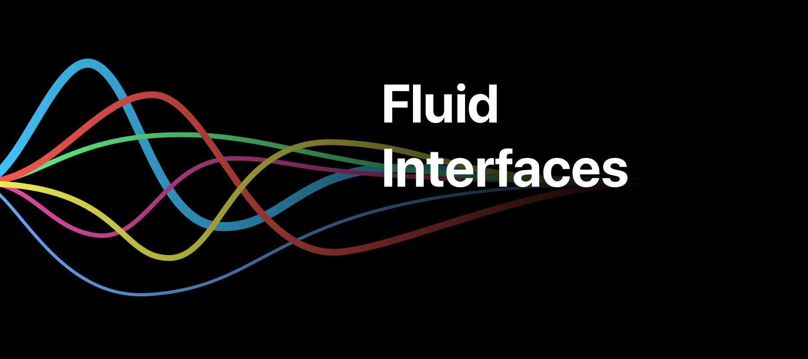

# Fluid Interfaces
Code for [Apple's WWDC18 presentation "Designing Fluid Interfaces"](https://developer.apple.com/videos/play/wwdc2018/803/)

## All Interfaces

### Calculator Button

[📺 Designing Fluid Interfaces 50:13](https://developer.apple.com/videos/play/wwdc2018/803/?time=3013)

 

### Spring Animations

[📺 Designing Fluid Interfaces 31:40](https://developer.apple.com/videos/play/wwdc2018/803/?time=1900)

 

### Flashlight Button

[📺 Designing Fluid Interfaces 37:59](https://developer.apple.com/videos/play/wwdc2018/803/?time=2279)

 

### Rubberbanding

[📺 Designing Fluid Interfaces 17:01](https://developer.apple.com/videos/play/wwdc2018/803/?time=1021)

### Acceleration Pausing

[📺 Designing Fluid Interfaces 10:40](https://developer.apple.com/videos/play/wwdc2018/803/?time=640)

### Rewarding Momentum

[📺 Designing Fluid Interfaces 36:48](https://developer.apple.com/videos/play/wwdc2018/803/?time=2208)

### FaceTime PiP

[📺 Designing Fluid Interfaces 41:56](https://developer.apple.com/videos/play/wwdc2018/803/?time=2516)

### Rotation

[📺 Designing Fluid Interfaces 47:25](https://developer.apple.com/videos/play/wwdc2018/803/?time=2845)

## Author
You can find me on Twitter [@nathangitter](https://twitter.com/nathangitter)

## Copyright
© 2018 Nathan Gitter
